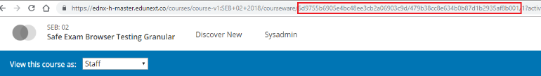
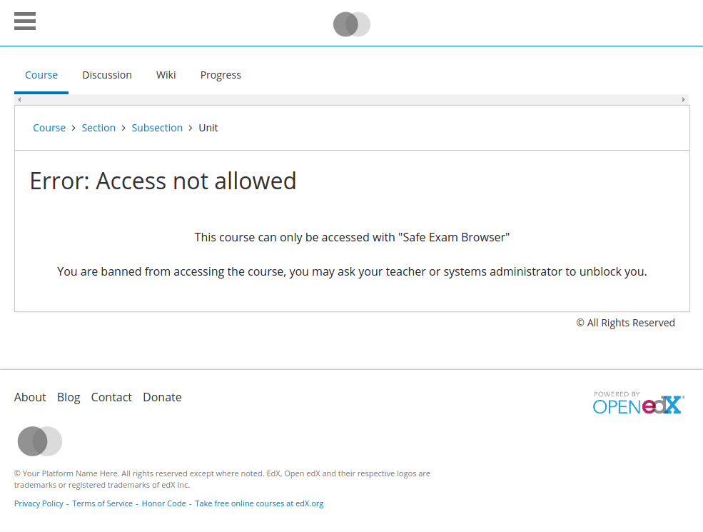
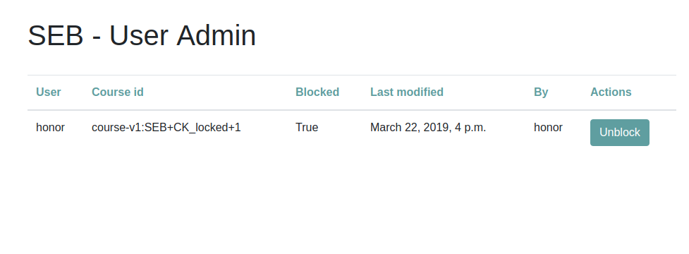

=======================
Usage and configuration
=======================

The SEB Open edX plugin is a very flexible plugin and most of its options can be configured.

Plugin Settings
===============

The first thing than can be configured is the plugin itself. For this, the plugin works together with the Open edX platform so that the global settings can be defined in the same way every other property in the platform is.

Both for Native or for Devstack environments there is a set of files ``lms.env.json``, ``cms.env.json``, that allow the instance administrators to change the global settings of the plugin.

If you want to modify any of this settings, you need to add a new key inside of the json files for the ``lms`` and ``cms`` and restart the server.

Example:

    to globally modify the available permissions you would modify the ``SEB_PERMISSION_COMPONENTS``

    .. code-block:: json

        {
            ...
            "SEB_PERMISSION_COMPONENTS": [
                "AlwaysAllowStaff",
                "CheckSEBHashBrowserExamKey",
                "CheckSEBHashConfigKey"
            ]
            ...
        }

If you are using *ansible* and the `configuration <https://github.com/edx/configuration>`_ project, then you want to modify the ``EDXAPP_LMS_ENV_EXTRA`` and ``EDXAPP_CMS_ENV_EXTRA`` variables.

The same change done in ansible:

    .. code-block:: yaml

        EDXAPP_LMS_ENV_EXTRA:
            ...
            SEB_PERMISSION_COMPONENTS:
              - AlwaysAllowStaff
              - CheckSEBHashBrowserExamKey
              - CheckSEBHashConfigKey
            ...

Variables
---------

This is the list of variables that you can alter globally

- **SEB_PERMISSION_COMPONENTS**
    Default: ``['AlwaysAllowStaff', 'CheckSEBHashBrowserExamKeyOrConfigKey']``

    List of permission classes for the project. If one of the enabled classes grants access, the user will have access to the course.
    Can be modified on a per-course basis.

- **SEB_KEY_SOURCES**
    Default: ``['from_global_settings', 'from_other_course_settings', 'from_django_model', 'from_site_configuration']``

    List of locations where the course settings will be read from.

- **SEB_KEY_DESTINATIONS**
    Default: ``['to_django_model', 'to_other_course_settings', 'to_site_configuration']``

    List of locations where the course settings will be stored to.

- **SEB_USER_BANNING_BACKEND**
    Default: ``'DatabaseBannedUsersBackend'``

    The user banning backend will determine where the status of banning for a course-user pair is stored. The only available backend in this version is the database backend.

- **SEB_USER_BANNING_ENABLED**
    Default: ``False``

    Global feature toggle for the user banning feature. Can be modified on a per-course basis.

- **SEB_UPDATE_MODULESTORE**
    Default: ``'seb_openedx.edxapp_wrapper.backends.get_course_module_h_v1'``

    This setting controls the backend implementation for the update module wrapper. Defaults to the hawthorn compatible implementation.

- **SEB_COURSE_MODULE**
    Default: ``'seb_openedx.edxapp_wrapper.backends.get_course_module_h_v1'``

    This setting controls the backend implementation for the course_module wrapper. Defaults to the hawthorn compatible implementation.

- **SEB_COURSEWARE_MODULE**
    Default: ``'seb_openedx.edxapp_wrapper.backends.get_courseware_module_h_v1'``

    This setting controls the backend implementation for the courseware_module wrapper. Defaults to the hawthorn compatible implementation.

- **SEB_COURSEWARE_INDEX_VIEW**
    Default: ``'seb_openedx.edxapp_wrapper.backends.get_courseware_index_view_h_v1'``

    This setting controls the backend implementation for the courseware_index_view wrapper. Defaults to the hawthorn compatible implementation.

- **SEB_GET_CHAPTER_FROM_LOCATION**
    Default: ``'seb_openedx.edxapp_wrapper.backends.get_chapter_from_location_h_v1``

    This setting controls the backend implementation for the chapter locator wrapper. Defaults to the hawthorn compatible implementation.

- **SEB_CONFIGURATION_HELPERS**
    Default: ``'seb_openedx.edxapp_wrapper.backends.get_configuration_helpers_h_v1'``

    This setting controls the backend implementation for the configuration_helper wrapper. Defaults to the hawthorn compatible implementation.

- **SEB_EDXMAKO_MODULE**
    Default: ``'seb_openedx.edxapp_wrapper.backends.edxmako_module_h_v1'``

    This setting controls the backend implementation for the mako renderer wrapper. Defaults to the hawthorn compatible implementation.

- **SEB_USE_ALL_SOURCES**
    Default: ``True``

    This setting controls the whether the first source to return a key for a course should be used, of if all of them will be added in order.

- **SEB_ALLOW_MFE_ACCESS**
    Default: ``False``

    This setting allows the learning MFE to render the course_home views so that a user can interact with the course outline and navigate to the units.

    This setting can also be activated for individual courses in the course-specific configuration. Use the ``ALLOW_MFE_ACCESS`` for this.

    Example:

        .. code-block:: json

            "SAFE_EXAM_BROWSER":{
                "course-v1:seb-openedx+course_2+2024":{
                  "BROWSER_KEYS":[
                    "cd8827e4555e4eef82........5088a4bd5c9887f32e590"
                  ],
                  "CONFIG_KEYS":[
                    "9887f32e590cd8827e........5088a4bd5c4555e4eef82"
                  ],
                  "ALLOW_MFE_ACCESS": true
                }
            }

- **SEB_INDIVIDUAL_COURSE_ACTIVATION**
    Default: ``False``

    This setting modifies how each course reacts to the seb middleware. When the settings is set to `False`, the seb-openedx connection will enable the restrictions for every course where it can find a Browser or Config key set. When set to `True` seb-openedx will require that the configuration for an individual course contains the key `"ENABLED": True`

    Example:

        .. code-block:: json

            "SAFE_EXAM_BROWSER":{
                "course-v1:seb-openedx+course_2+2024":{
                  "BROWSER_KEYS":[
                    "cd8827e4555e4eef82........5088a4bd5c9887f32e590"
                  ],
                  "CONFIG_KEYS":[
                    "9887f32e590cd8827e........5088a4bd5c4555e4eef82"
                  ],
                  "ENABLED": true
                }
            }

    Example of the ``other_course_settings`` config when using together with instance wide keys:

        .. code-block:: json

            "SAFE_EXAM_BROWSER":{
                "ENABLED": true
            }

Key Hashes
==========

One of the properties of the Safe Exam Browser is that it can send a HTTP header with every request, to inform the server of the current configuration for the browser.

This headers are of two distinct types. The *Safe Browser Key* and the *Config Key*. The SEB Open edX plugin supports both types of keys.

For more advanced information about the keys, you can refer to the official `SEB documentation <https://safeexambrowser.org/macosx/mac_usermanual_en.html#configuration>`_. We will only mention that the keys are viable at the Browser settings under the *Exam* tab. This exact keys are what you need to copy at the ``BROWSER_KEYS``
and ``CONFIG_KEYS`` lists on the `Access Settings`_ configuration.

    .. image:: images/seb_settings.png

Access Settings
===============

The idea with the Safe Exam Browser is to control the access from students in the course to the course itself. To configure this you need to let the Open edX server know what requirements for access you will impose on the course.

This is done on a per-course basis and can be modified in 3 different locations as configured in the **SEB_KEY_SOURCES** variable.

#. Global settings ``from_global_setting``

    As before for the global settings, you can add a key ``SAFE_EXAM_BROWSER`` to the ``lms.env.json`` file and inside of it, a dictionary with objects containing the ``<course_id>`` and configurations.

    Additionally a instance wide seb key can be set for all courses in the open edX instance using the ``default`` key in the ``SAFE_EXAM_BROWSER`` dictionary.

    Here is an example of setting restrictions on two different courses at the same time. The course ``course-v1:seb-openedx+course_1+2019`` uses the simple list notation and the ``course-v1:seb-openedx+course_2+2019`` uses a more advanced notation with more settings.

    .. code-block:: json

        "SAFE_EXAM_BROWSER":{
            "course-v1:seb-openedx+course_1+2019":[
                "cd8827e4555e4eef82........5088a4bd5c9887f32e590",
                "9887f32e590cd8827e........5088a4bd5c4555e4eef82",
            ],
            "course-v1:seb-openedx+course_2+2019":{
              "PERMISSION_COMPONENTS":[
                "AlwaysAllowStaff",
                "CheckSEBHashBrowserExamKey",
                "CheckSEBHashConfigKey"
              ],
              "BROWSER_KEYS":[
                "cd8827e4555e4eef82........5088a4bd5c9887f32e590"
              ],
              "CONFIG_KEYS":[
                "9887f32e590cd8827e........5088a4bd5c4555e4eef82"
              ],
              "USER_BANNING_ENABLED":true,
              "ALLOW_MFE_ACCESS": true,
              "ENABLED": true
            }
        }

    Using ansible:

    .. code-block:: yaml

        EDXAPP_LMS_ENV_EXTRA:
            ...
            SAFE_EXAM_BROWSER:
              - "course-v1:seb-openedx+course_1+2019":
                - cd8827e4555e4eef82........5088a4bd5c9887f32e590
                - 9887f32e590cd8827e........5088a4bd5c4555e4eef82
              - "course-v1:seb-openedx+course_2+2019":
                - PERMISSION_COMPONENTS:
                  - AlwaysAllowStaff
                  - CheckSEBHashBrowserExamKey
                  - CheckSEBHashConfigKey
                - BROWSER_KEYS:
                    - cd8827e4555e4eef82........5088a4bd5c9887f32e590
                - CONFIG_KEYS:
                    - 9887f32e590cd8827e........5088a4bd5c4555e4eef82
                - USER_BANNING_ENABLED: True
                - ALLOW_MFE_ACCESS: True
                - ENABLED: True
            ...

    This is an example of using the instance wide seb key option in the json configuration:

    .. code-block:: json

        "SAFE_EXAM_BROWSER":{
            "default": [
                "cd8827e4555e4eef82........5088a4bd5c9887f32e590",
                "9887f32e590cd8827e........5088a4bd5c4555e4eef82",
            ]
        }

#. Advanced studio settings ``from_other_course_settings``

    The other course settings is a new field in the Studio Advanced configurations that is available short after the Hawthorn release was cut. It can be backported to Hawthorn easily, but officially it is only available starting at the Ironwood release.

    .. image:: images/other_course_settings.png

    In this ``json`` field you can add the ``SAFE_EXAM_BROWSER`` key and inside of it the configurations for this course.

    .. image:: images/other_course_settings_without_course_key.png

    You could optionally use the course key as well

    .. image:: images/other_course_settings_data.png

#. Site Configuration in the admin ``from_site_configuration``

    On the site configurations you can add a key ``SAFE_EXAM_BROWSER`` to the site ``values`` and inside of it, a dictionary with objects containing the ``<course_id>`` and configurations. Very similar to the ``from_global_settings``.

    Here is an example with the same configuration as before:

    .. image:: images/site_configuration_data.png

    .. note::
        The site configuration module uses a cache to improve the read performance for succesive reads. Unlike other caches in the platform that use memcached, this is a local thread cache that is implemented in the django-crud package.

        When you change values in the site configuration object, the easiest way to break the cache is to do a process restart.

        .. code-block:: bash

            make lms-restart

#. Model Configuration in the admin ``from_django_model``

    Add the settings using a line break between them.

    .. image:: images/seb_django_model.png

    .. note::
        It is required to run the migrations.

Advanced usage
==============

The basic usage of the SEB Open edX plugin grants or denies access to a complete course. This means that every page of the course will be blocked for access without the configured Safe Exam Browser.

More advanced users can make use of the `Path Whitelisting`_ or the granular options `Chapter Blacklisting`_(Sections), `Sequence Blacklisting`_(Subsections) and `Vertical Blacklisting`_(Units) options to provide a more flexible approach.

Path Whitelisting
-----------------

As we mentioned before, the default of a course requiring a given SEB Key for access is to be completely blocked.
Now, some pages of the course might not require such a restriction. For those you can grant access even without the Safe Exam Browser by using the ``WHITELIST_PATHS`` list.

.. code-block:: json

    "course-v1:seb-openedx+course_1+2019": {
        "BROWSER_KEYS":[
        "cd8827e4555e4eef82........5088a4bd5c9887f32e590"
        ],
        "CONFIG_KEYS":[
        "9887f32e590cd8827e........5088a4bd5c4555e4eef82"
        ],
        "WHITELIST_PATHS": ["wiki", "about"]
    }

This will grant access to the course wiki and the external course about page even without the special browser or configurations.

Some important paths that can be whitelisted are:

- ``"about"``
- ``"course-outline"``
- ``"courseware"``
- ``"discussion"``
- ``"progress"``
- ``"wiki"``

Chapter Blacklisting
--------------------

In the previous section we mentioned that ``"courseware"`` can be whitelisted. This would grant a user complete access to the course content thus defeating the purpose of the SEB Open edX plugin. For this the *Chapter Blacklisting* allows you to mark specific chapters for secure access.

Here it is worth noting that the naming convention is used differently in the user visible pages and in the code.

*Code*

Both the Code and the `OLX or Open Learning XML <https://open.edx.org/blog/open-learning-xml-olx-format/>`_ use a hierarchy composed of ``course > chapter > sequential > vertical``. This is the convention used for development here.

*Studio*

On Studio, the exact same hierarchy is composed of ``course > section > subsection > unit``.

This means that a ``chapter`` is the same a a ``section`` and a ``sequential`` the same as a ``subsection``.

Example:

.. code-block:: json

    "course-v1:seb-openedx+course_1+2019": {
        "BROWSER_KEYS":[
        "cd8827e4555e4eef82........5088a4bd5c9887f32e590"
        ],
        "CONFIG_KEYS":[
        "9887f32e590cd8827e........5088a4bd5c4555e4eef82"
        ],
        "WHITELIST_PATHS": ["wiki", "about", "courseware", "course-outline"],
        "BLACKLIST_CHAPTERS": ["e87b8744ea3949989f8aa113ad428515"]
    }

You will find the ID of the chapter in the URL

For instance if your url is:

.. code-block:: bash

    https://courses.yourdomain.com/courses/course-v1:seb-openedx+course_1+2019/courseware/e87b8744ea3949989f8aa113ad428515/10ddf7ff3a0a4e2f80c8838528e8c93e/1

Your chapter ID is:

.. code-block:: bash

    https://courses.yourdomain.com/courses/course-v1:seb-openedx+course_1+2019/courseware/<CHAPTER_ID>/10ddf7ff3a0a4e2f80c8838528e8c93e/1

Which means your chapter ID is `e87b8744ea3949989f8aa113ad428515`.

As always you can use a list of IDs for multiple chapters.

Sequence Blacklisting
--------------------

In the same way as chapters, sequences can also be specifically restricted when ``"courseware"`` is whitelisted. Using *Sequence Blacklisting* allows you to mark specific Sequences, also called **Subsections** in the Studio interface, for secure access. See the `Chapter Blacklisting`_ explanation for more detail.

Example of subsection restriction using the learning MFE:

.. code-block:: json

    "course-v1:seb-openedx+course_1+2024": {
        "BROWSER_KEYS":[
        "cd8827e4555e4eef82........5088a4bd5c9887f32e590"
        ],
        "CONFIG_KEYS":[
        "9887f32e590cd8827e........5088a4bd5c4555e4eef82"
        ],
        "WHITELIST_PATHS": ["courseware"],
        "BLACKLIST_SEQUENCES": ["f80c166b31da4a129f2d23f9fe8bb97b"]
        "ALLOW_MFE_ACCESS": true
    }

Vertical Blacklisting
--------------------

Verticals, also called **Units** in Studio work similarly and can be marked for secure access using the ``BLACKLIST_VERTICALS`` key. See the `Chapter Blacklisting`_ explanation for more detail.

Example of unit restriction using the learning MFE:

.. code-block:: json

    "course-v1:seb-openedx+course_1+2024": {
        "BROWSER_KEYS":[
        "cd8827e4555e4eef82........5088a4bd5c9887f32e590"
        ],
        "CONFIG_KEYS":[
        "9887f32e590cd8827e........5088a4bd5c4555e4eef82"
        ],
        "WHITELIST_PATHS": ["courseware"],
        "BLACKLIST_VERTICALS": ["43405e86a57143e9953e3d990bece4e4"]
        "ALLOW_MFE_ACCESS": true
    }

User Banning
------------

The user banning feature allows the administrator of a course to permanently ban a user from access if the user has attempted to access with a different browser of an incorrectly configured SEB.

This feature is by default turned off, but can be turned on either on the global `Plugin Settings`_ with the ``SEB_USER_BANNING_ENABLED`` key or per course on the `Access Settings`_ using the ``USER_BANNING_ENABLED`` key.

When a user has been banned, a message will appear on the page saying that the user is banned and that the teacher or systems administrator can assist them.

When this happens, a staff member can unlock the user by navigating to the seb-openedx dashboard.

It is located at: https://courses.yourdomain.com/seb-openedx/dashboard/

